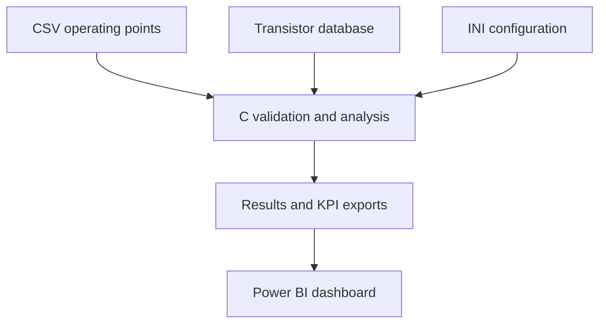
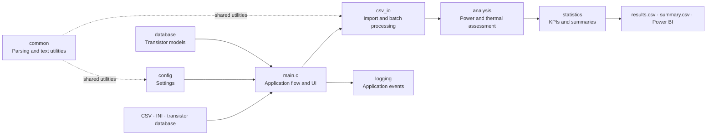

# TransiSafe 2.0

<p align="center">
  <a href="https://github.com/AnnaKolisnyk74/TransiSafe-2.0/actions/workflows/build-and-test.yml"></a>
  
  
  <a href="https://github.com/AnnaKolisnyk74/TransiSafe-2.0/releases/tag/v2.1.0"></a>
  
</p>

**C-based engineering safety analysis and decision-support tool with Power BI visualization**

TransiSafe 2.0 is an independently developed portfolio project that combines electronics, C programming, data analysis, software testing, and management-oriented visualization.

The application evaluates synthetic operating points of BJT and MOSFET transistor models. It calculates power dissipation, estimated junction temperature, power margin, and temperature margin. Each operating point is classified as `SAFE`, `CRITICAL`, or `NOT SAFE`. For critical and unsafe cases, the application also calculates possible current and voltage reductions.

> [!IMPORTANT]
> The included transistor models and operating points are synthetic demonstration data. This project is intended for learning and portfolio purposes and must not be used to validate or certify real safety-critical electronic systems.

> [!NOTE]
> **Model scope:** TransiSafe 2.0 implements a simplified thermal and power-based operating-point assessment. It does not reproduce the complete manufacturer-defined Safe Operating Area (SOA) curve of a real semiconductor device. A full SOA assessment can additionally include voltage and current limits, pulse duration, transient thermal impedance, secondary breakdown, package limits, and other manufacturer-specific constraints.

## Power BI views

### Technical Analysis


### Management Overview


## Management extension

Development steps 11–14 add a management-oriented perspective to the technical analysis:

- priority ranking and criticality scoring for individual operating points
- recommended technical actions for critical and unsafe cases
- portfolio-level management KPIs in `management_summary.csv`
- a dedicated **Management Overview** page in Power BI

The progressive implementation snapshots for these steps are available in `docs/source_snapshots/`.

## Project workflow



## Software architecture

The application is divided into focused C11 modules so that engineering calculations, data handling, and presentation concerns can be developed and tested independently.



## Key features

- interactive analysis of individual operating points
- batch import of multiple operating points from CSV
- external transistor database with automatic model assignment
- configurable warning thresholds and file paths
- calculation of power dissipation and estimated junction temperature
- calculation of power and temperature safety margins
- status classification with `SAFE`, `CRITICAL`, and `NOT SAFE`
- suggested maximum current and voltage values for unsafe cases
- detailed CSV results and aggregated KPI export
- timestamped application logging
- model-specific statistics and runtime measurement
- interactive Power BI dashboard
- management priority ranking and criticality scoring
- recommended actions for critical and unsafe operating points
- management KPI export in `management_summary.csv`
- separate technical and management Power BI views
- modular C11 architecture with separated analysis, I/O, configuration, database, logging, and statistics components
- automated unit tests for core calculations and boundary conditions
- documented test catalog covering valid, invalid, mixed, and extreme inputs

## Calculation model

The core demonstration model uses the following relationships:

- power dissipation: `P_loss = voltage × current`
- estimated junction temperature: `T_j = T_amb + P_loss × R_thJA`
- power margin: `P_max − P_loss`
- temperature margin: `T_j,max − T_j`

The application compares both the electrical power limit and the simplified thermal power limit when determining the limiting factor.

## Demonstration results

The documented scalability test processed 500 synthetic operating points.

| KPI | Result |
|---|---:|
| Total operating points | 500 |
| SAFE | 231 (46.2%) |
| CRITICAL | 69 (13.8%) |
| NOT SAFE | 200 (40.0%) |
| Attention Required | 269 (53.8%) |
| Highest Priority Case | 399 |
| Highest Risk Model | DEMO_MOSFET_02 |
| Average estimated junction temperature | 143.44 °C |
| Maximum estimated junction temperature | 256.92 °C |

Runtime measurements are environment-dependent and should be interpreted only as the result of the documented test run.

<details>
<summary><strong>Repository structure</strong></summary>

<br>

```text
TransiSafe-2.0/
├── src/
│   ├── main.c           Application entry point and interactive UI
│   ├── analysis.c/.h    Electrical and thermal assessment
│   ├── csv_io.c/.h      CSV parsing and batch processing
│   ├── config.c/.h      INI configuration
│   ├── database.c/.h    Transistor database
│   ├── logging.c/.h     Timestamped application logging
│   ├── statistics.c/.h  KPI aggregation and summary export
│   └── common.c/.h      Shared parsing and text utilities
├── tests/
│   ├── unit_tests.c     Automated core-function tests
│   └── T01–T07          CSV integration scenarios
├── dashboard/           Power BI project file
├── assets/              Technical and management dashboard previews
├── docs/                Development reports for steps 1 to 14
├── transisafe.ini       Application configuration
├── transistors.csv      Synthetic transistor database
├── operating_points_large.csv
│                        Scalability dataset and test T08
├── results.csv          Detailed demonstration output
├── summary.csv          Aggregated technical KPIs
└── management_summary.csv
                         Aggregated management KPIs
```

</details>

<details>
<summary><strong>Build requirements and instructions</strong></summary>

<br>

### Requirements

- CMake 3.20 or newer
- a C11 compiler, such as Microsoft Visual C++ or GCC
- Microsoft Power BI Desktop only when opening the dashboard project

### Build and run

Configure and build from the repository root:

```sh
cmake -S . -B build
cmake --build build --config Release
```

On Windows, run `build\Release\transisafe.exe`. With a single-configuration generator, run `build/transisafe`.

The program must be started from the repository root so that it can locate `transisafe.ini` and `transistors.csv`.

After startup, choose:

1. interactive analysis of one operating point, or
2. CSV batch analysis using one of the supplied datasets.

The generated files are configured in `transisafe.ini`. By default, the application writes `results.csv`, `summary.csv`, and `transisafe.log` to the current working directory.

When opening the Power BI file on another computer, the local CSV data-source paths may need to be updated.

</details>

<details>
<summary><strong>Test coverage</strong></summary>

<br>

| Test | Scenario |
|---|---|
| T01 | Valid operating points |
| T02 | Unknown transistor ID |
| T03 | Negative voltage |
| T04 | Invalid numeric value |
| T05 | Empty input file |
| T06 | Mixed valid and invalid records |
| T07 | Extreme ambient temperature |
| T08 | Scalability test with 500 operating points |

The automated unit-test executable additionally verifies:

- calculation of `P_loss`
- calculation of `T_j`
- classification at an exact boundary
- maximum allowable current under the limiting power constraint
- rejection of invalid numeric values
- selection of the most critical operating point

Run all registered unit tests with:

```sh
ctest --test-dir build -C Release --output-on-failure
```

GitHub Actions runs both the unit-test suite and the full 500-point smoke test on Windows.

</details>

<details>
<summary><strong>Development documentation</strong></summary>

<br>

The `docs` directory contains fourteen development reports covering the progressive extension of the application:

1. safety margins and status classification
2. logging
3. external configuration
4. transistor database
5. optimization suggestions
6. CSV batch import
7. statistics and KPIs
8. scalability test
9. Power BI dashboard
10. quality assurance and runtime measurement
11. priority logic and management ranking
12. recommended actions
13. management summary KPIs
14. Management Overview in Power BI

</details>

## What I learned

- how to translate simplified electrical and thermal equations into a reproducible C11 analysis pipeline
- why separating application flow, configuration, data access, I/O, calculations, logging, and statistics makes a technical system easier to maintain
- how unit tests and continuous integration protect expected behavior during refactoring
- how to communicate engineering assumptions, validation results, and model limitations transparently
- how to transform detailed technical output into decision-oriented KPIs and a Power BI dashboard

## Author

**Anna Kolisnyk**

Combining experience in electrical engineering and C programming with business administration, data analytics, and Power BI. Focused on transforming technical data into structured analyses, visualizations, and decision-support solutions for the energy sector.

## License

This project is available for non-commercial learning and demonstration purposes. See [LICENSE](LICENSE) for details.
