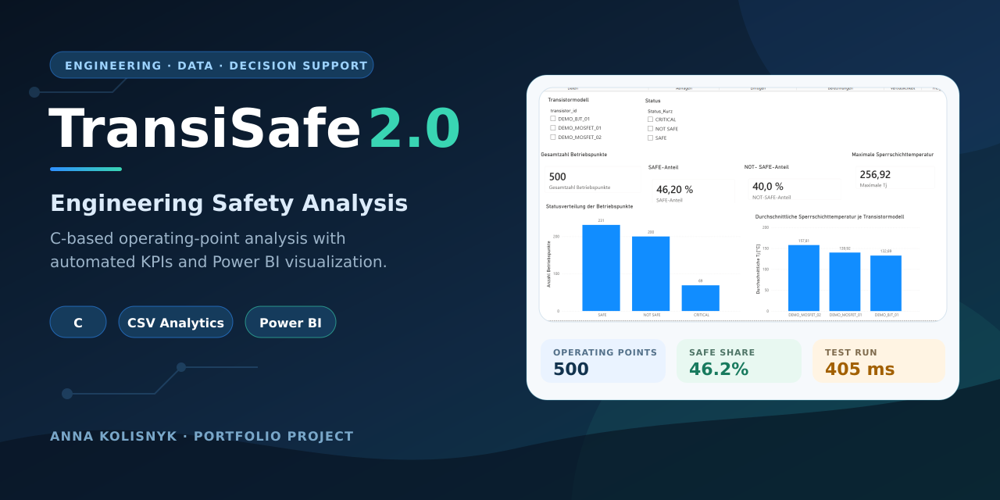
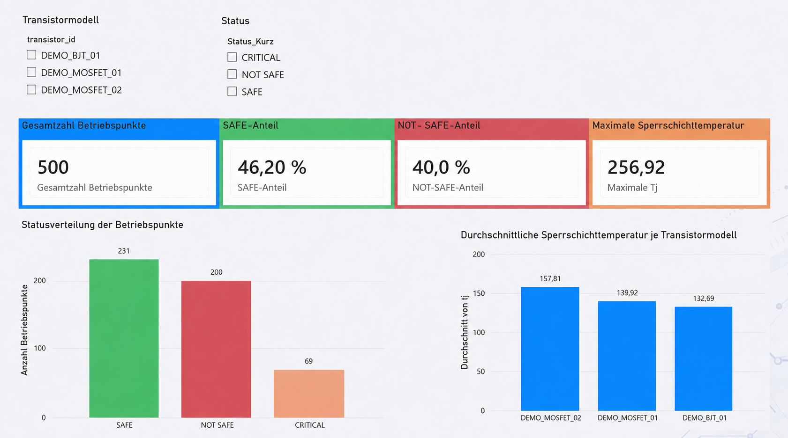
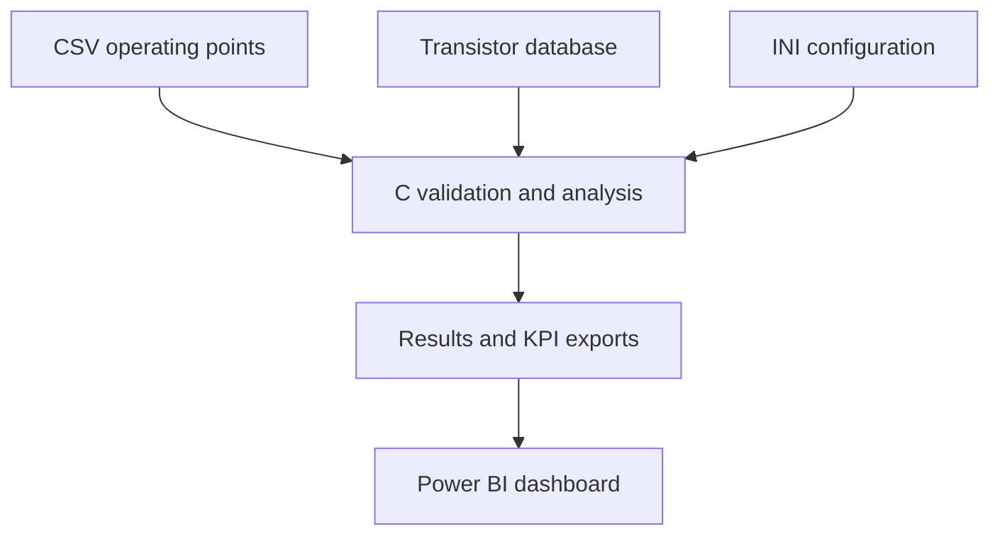

<p align="center">
  
</p>

# TransiSafe 2.0

<p align="center">
  <a href="https://github.com/AnnaKolisnyk74/TransiSafe-2.0/actions/workflows/build-and-test.yml"></a>
  
  
  <a href="https://github.com/AnnaKolisnyk74/TransiSafe-2.0/releases/tag/v2.0.0"></a>
  
</p>

**C-based engineering safety analysis and decision-support tool with Power BI visualization**

TransiSafe 2.0 is an independently developed portfolio project that combines electronics, C programming, data analysis, software testing, and management-oriented visualization.

The application evaluates synthetic operating points of BJT and MOSFET transistor models. It calculates power dissipation, estimated junction temperature, power margin, and temperature margin. Each operating point is classified as `SAFE`, `CRITICAL`, or `NOT SAFE`. For critical and unsafe cases, the application also calculates possible current and voltage reductions.

> [!IMPORTANT]
> The included transistor models and operating points are synthetic demonstration data. This project is intended for learning and portfolio purposes and must not be used to validate or certify real safety-critical electronic systems.



## Project workflow



## Key features

- interactive analysis of individual operating points
- batch import of multiple operating points from CSV
- external transistor database with automatic model assignment
- configurable warning thresholds and file paths
- calculation of power dissipation and estimated junction temperature
- calculation of power and temperature safety margins
- status classification with `SAFE`, `CRITICAL`, and `NOT SAFE`
- suggested maximum current and voltage values for unsafe cases
- detailed CSV results and aggregated KPI export
- timestamped application logging
- model-specific statistics and runtime measurement
- interactive Power BI dashboard
- documented test catalog covering valid, invalid, mixed, and extreme inputs

## Calculation model

The core demonstration model uses the following relationships:

- power dissipation: `P_loss = voltage × current`
- estimated junction temperature: `T_j = T_amb + P_loss × R_thJA`
- power margin: `P_max − P_loss`
- temperature margin: `T_j,max − T_j`

The application compares both the electrical power limit and the simplified thermal power limit when determining the limiting factor.

## Demonstration results

The documented scalability test processed 500 synthetic operating points.

| KPI | Result |
|---|---:|
| Total operating points | 500 |
| SAFE | 231 (46.2%) |
| CRITICAL | 69 (13.8%) |
| NOT SAFE | 200 (40.0%) |
| Average estimated junction temperature | 143.44 °C |
| Maximum estimated junction temperature | 256.92 °C |
| Processing time in the documented test run | 405 ms |

Runtime measurements are environment-dependent and should be interpreted only as the result of the documented test run.

<details>
<summary><strong>Repository structure</strong></summary>

<br>

```text
TransiSafe-2.0/
├── src/                 C source code
├── tests/               CSV test cases T01 to T07
├── dashboard/           Power BI project file
├── assets/              Dashboard preview
├── docs/                Documentation of development steps 1 to 10
├── transisafe.ini       Application configuration
├── transistors.csv      Synthetic transistor database
├── operating_points_large.csv
│                        Scalability dataset and test T08
├── results.csv          Detailed demonstration output
└── summary.csv          Aggregated KPIs
```

</details>

<details>
<summary><strong>Build requirements and instructions</strong></summary>

<br>

### Requirements

- Windows
- Microsoft Visual Studio with the C/C++ build tools
- Microsoft Power BI Desktop to open the dashboard

The source uses Microsoft secure CRT functions and is therefore currently intended for compilation with MSVC.

### Build and run

Open a **Developer Command Prompt for Visual Studio** in the repository root and run:

```bat
cl /W4 /O2 src\transisafe.c /Fe:transisafe.exe
transisafe.exe
```

The program must be started from the repository root so that it can locate `transisafe.ini` and `transistors.csv`.

After startup, choose:

1. interactive analysis of one operating point, or
2. CSV batch analysis using one of the supplied datasets.

The generated files are configured in `transisafe.ini`. By default, the application writes `results.csv`, `summary.csv`, and `transisafe.log` to the current working directory.

When opening the Power BI file on another computer, the local CSV data-source paths may need to be updated.

</details>

<details>
<summary><strong>Test coverage</strong></summary>

<br>

| Test | Scenario |
|---|---|
| T01 | Valid operating points |
| T02 | Unknown transistor ID |
| T03 | Negative voltage |
| T04 | Invalid numeric value |
| T05 | Empty input file |
| T06 | Mixed valid and invalid records |
| T07 | Extreme ambient temperature |
| T08 | Scalability test with 500 operating points |

All documented tests were completed successfully in the original Microsoft Visual Studio environment.

</details>

<details>
<summary><strong>Development documentation</strong></summary>

<br>

The `docs` directory contains ten development reports covering the progressive extension of the application:

1. safety margins and status classification
2. logging
3. external configuration
4. transistor database
5. optimization suggestions
6. CSV batch import
7. statistics and KPIs
8. scalability test
9. Power BI dashboard
10. quality assurance and runtime measurement

</details>

## Author

**Anna Kolisnyk**

Combining experience in electrical engineering and C programming with business administration, data analytics, and Power BI. Focused on transforming technical data into structured analyses, visualizations, and decision-support solutions for the energy sector.

## License

This project is available for non-commercial learning and demonstration purposes. See [LICENSE](LICENSE) for details.
