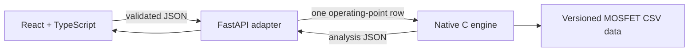

# Phase 2: browser application foundation

## Goal

Phase 2 makes the Phase 1 MOSFET engine usable through a browser without
duplicating engineering equations in JavaScript or Python.

## Trust boundary

- `src/json_main.c` is the non-interactive adapter to the existing C modules.
- `api/main.py` validates HTTP input and invokes the native executable. It does
  not calculate losses, SOA limits or temperatures.
- `web/` displays inputs, decisions, margins, checks and source provenance. It
  does not independently classify a point.
- A missing executable, invalid input, malformed engine response or unavailable
  curve is returned as an explicit error or `INSUFFICIENT_DATA`, never as
  `SAFE`.

## First web slice

The first interface supports:

- linear and switching modes
- electrical, pulse and thermal inputs
- model selection from the versioned database
- status, loss breakdown, temperature, SOA and individual limit checks
- maximum-current and maximum-voltage recommendations from the C engine
- datasheet URL, revision and retrieval date
- responsive desktop and mobile layouts

## Verification

GitHub Actions builds the native executable, runs the C unit and CSV regression
tests, exercises the Python adapter against the executable, and creates a
production frontend bundle.

## Deliberately not included yet

- user accounts, saved projects or database persistence
- multi-user deployment and rate limiting
- PDF reports
- automatic datasheet extraction
- production approval of digitized MOSFET curves

Those capabilities should only be added after the stateless analysis path is
reviewed as a complete unit.
